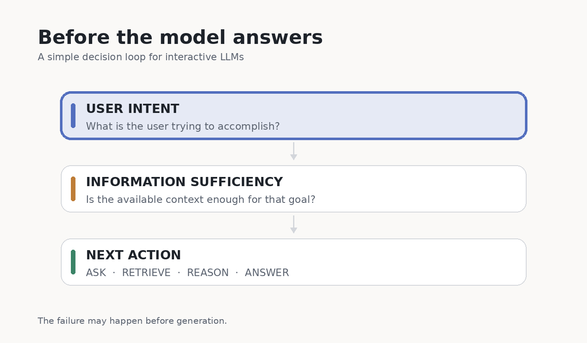

I keep coming back to a simple question:

> **Does the model actually have enough information to answer?**

I first ran into this while working on dialogue summarization.

The task was not to summarize an entire conversation, but only a segment of it. The problem was that a segment is often not self-contained.

Someone might say:

> “Okay, let’s go with that approach.”

The sentence is understandable on its own. But a useful summary may still need to know **what _that approach_ refers to** or **why it was chosen**. That evidence may live several turns earlier.

At the time, the problem I cared about was:

> **Can we identify what evidence is missing from the current segment, then retrieve specifically for that gap?**

So the rough pipeline became:

**missing evidence → targeted retrieval → generation**

That was a fairly specific summarization problem. But I now think the same structure appears in many LLM interactions.

## The failure may happen before generation

Consider prompts like:

- “Which one is better for me?”
- “Can you improve this?”
- “What should I do next?”

The model may not have enough information to give a useful answer.

Maybe a user constraint is unstated.  
Maybe an earlier turn contains a necessary detail.  
Maybe the answer depends on an external source.

Yet the model often answers anyway.

Then the user corrects it. The model tries again. Another condition appears. The conversation gets longer, more tokens are spent, and the original intent can become harder to track.

This makes me think that some bad answers are not primarily **generation failures**.

They are **information-state failures**.

## Three questions before answering

I find it useful to separate three decisions.

**1. What is the user actually trying to accomplish?**

The literal request is not always the goal.

“Summarize this” can mean preparing a status update, extracting decisions, or creating something to remember later. The information needed depends on the goal.

**2. Is the available information sufficient for that goal?**

This is different from asking whether the model is confident.

A model can be confident while missing an important piece of context. A long context window can still contain the wrong evidence.

**3. If something is missing, what should happen next?**

- If only the user can provide it → **ASK**
- If it exists in an external source → **RETRIEVE**
- If it is already present but needs additional processing → **REASON**
- If the information is sufficient → **ANSWER**

The interesting question is not only whether a model *can* answer.

It is whether it *should answer yet*.

## Retrieval can fail before retrieval starts

This also changes how I think about RAG.

A typical retrieval setup starts with a query. The task is then to retrieve better evidence for that query.

But in an interactive system, there is an earlier problem:

> **What if the model has not identified the information it actually needs?**

In that case, improving the retriever may not fix the bottleneck.

I want to distinguish:

**retrieval failure**  
from  
**information-need identification failure**

They can produce similar bad answers, but they call for different solutions.

## A metric I think is missing

Suppose two assistants eventually produce the same correct answer.

One gets there immediately.

The other requires three user corrections.

Should they receive the same score?

For an interactive system, probably not.

Besides final-answer quality, I think we should care about things such as:

- unnecessary dialogue turns,
- clarification burden,
- unnecessary retrieval or tool calls,
- token and latency cost,
- time until the user's goal is satisfied,
- whether the original intent survives a long interaction.

I do not yet know the right metric. But **interaction cost** feels like part of model quality, not only a product concern.

## The question I want to keep working on

The research question I keep returning to is:

> **How can an LLM determine whether the information available to it is sufficient to fulfill a user's intent?**

And, when it is not:

> **Can it identify what is missing and choose the right action to obtain it?**

A few questions I want to explore:

- How should information sufficiency be defined and evaluated?
- How is missing information different from uncertainty?
- When should a model ask the user instead of retrieving?
- Can **ASK / RETRIEVE / ANSWER** be learned as a decision policy?
- Can better information-state decisions reduce interaction cost?

I do not want an assistant that asks a clarification question every time it is slightly uncertain.

I want one that knows the difference between:

**enough information to act**  
and  
**one important thing is still missing**.

That distinction seems small, but I suspect it sits underneath a lot of frustrating LLM interactions.
